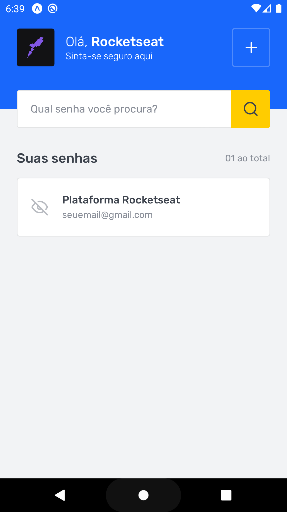

<h1 align="center">SavePass</h1>

<div align="center" style="display: flex; justify-content: space-around">




</div>

<br />

## 🧐 About <a name = "about"></a>

This is a password management application.

This application has two screens, the first is a list of saved passwords and the second is the screen for registering new logins.

## 🏁 Getting Started <a name = "getting_started"></a>

These instructions will get you a copy of the project up and running on your local machine for development and testing purposes.

### How to clone the project:

A step by step series of examples that tell you how to get a development env running.

First you have to run a git clone cli to clone the project: 

```
git clone https://github.com/lucas-hgs/ignite-react-native-savepass
```

After that, you have install all the modules that is necessary to run the project.

If you're using Yarn:

```
yarn
```

In case if you're using npm, please use:

```
npm install
```

After installing all the modules, you'll need to execute this command to run the application:


```
yarn start
```

Please, let me know if you have any question.